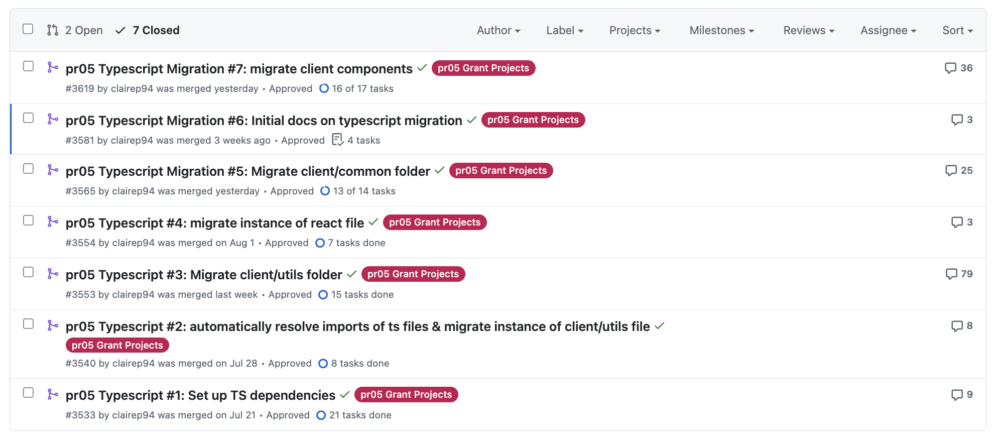

# Monthly Report - August: Incremental Typescript Migration for the p5.js Web Editor

## Overview

Over August, the PRs from July were reviewed, and received really useful feedback to action. As such I spent a great portion of the month going back to old PRs, updating to address feedback, and updating new PRs to use the learnings from these previous PRs. The learnings will be detailed below.

In addition to the refining the PRs from July, I have additionally opened PRs to:

- [Update the README to introduce the migration](https://github.com/processing/p5.js-web-editor/pull/3581)
- [Migrate the entire client/components folder](https://github.com/processing/p5.js-web-editor/pull/3619)
- [Migrate the root files related to redux, and migrate an instance of a redux reducer system (preferences system) -- draft PR](https://github.com/processing/p5.js-web-editor/pull/3633)

As of the end of August, the following have officially been merged into the codebase:



## Key Feedback & Typescript Styling Decisions:

### Use `interface` instead of `type` for defining props:

```tsx
// ✅ interface
interface ButtonProps {
  label: string
  disabled?: boolean
  onClick: () => void
}
const Button = ({ label, disabled, onClick }: ButtonProps) => (...)

// ❌ type
type ButtonProps = {
  label: string
  disabled?: boolean
  onClick: () => void
}

// ✅ keep type for primitives
type UserId = string;
```

<details>
<summary>Why?</summary>

- Clearer semantic meaning when describing structured objects vs. primitives

</details>

### Prefer named exports over default exports

```tsx
// ✅ named
export const Button = () => (...)
import { Button } from "./Button"

// ❌ default
export default Button
import Button from "./Button"
```

<details>
<summary>Why?</summary>

- Named exports make it easy to see what's exported and imported at a glance.

- Avoid renaming confusion and mismatched imports (e.g., import X from ... when the original name differs).
</details>

### Use `enum` instead of union types for prop variants

```tsx
// ✅ Enum for button variant
enum ButtonVariant {
  Primary = "primary",
  Secondary = "secondary",
}
interface ButtonProps {
  variant: ButtonVariant;
}

// ❌ Union type for button variant, not as preferrable.
type ButtonProps = {
  variant: "primary" | "secondary";
};
```

<details>
<summary>Why?</summary>

- Enums offer explicit, centralized definitions of allowed values.

- They prevent typo-related bugs and can be extended easily, often aligning better with team-wide or design-token systems.
</details>

## Challenges, Progress & Key Decisions:

This month was quite challenging, as I am not as experience with React and React Typescript syntax. I struggled a lot with figuring out how to resolve type-errors with `React.forwardRef` especially, which came up a lot with `useModalClose` and the components that used it. I am definitely still in the progress of learning what `refs` and `forwardRefs` are in React.

Through this process, I also learned more about `React.HTMLAttributes` and how React defines **base props** for native HTML elements. Extending from these base props allows custom components to inherit all standard attributes (like `id`, `className`, `style`, etc.) while layering on their own specific props. This makes it easier to build flexible, reusable components without losing type safety for the important props. Having only done React with JavaScript in the past, it was interesting to learn about the source of these attributes and see them explicitly declared in TypeScript, which made it much clearer how props are inherited and extended in custom components.

Another thing that came up was learning how to infer the base React component's props to attach to a component and how to overwrite its props with `Omit`. A concrete example of this was the `/client/common/ButtonOrLink` component: this component renders either a `<button>` or `<a>` depending on what props are passed to it. Originally I wanted to define strict discriminated unions for `<button>` and `<a>`, but because the codebase was originally written without TypeScript, this proved quite difficult to resolve without have a lot of type errors popup and having to re-write a lot of logic. To resolve this I chose to extend from `React.HTMLAttributes<HTMLElement>` instead to retain some flexibility, and align with the logic of how past developers had written this prior to Typescript (that this is a flexible component that renders different tags based on props passed).

```tsx
// /client/common/ButtonOrLink:
import React from "react";
import { Link } from "react-router-dom";

/**
 * Accepts all the props of an HTML <a> or <button> tag.
 */
export interface ButtonOrLinkProps extends React.HTMLAttributes<HTMLElement> {
  /**
   * Can be internal or external ('http'- or 'https'-).
   */
  href?: string;
  isDisabled?: boolean;
  /**
   * Content of the button/link.
   * Can be either a string or a complex element.
   */
  children: React.ReactNode;
  onClick?: (
    e: React.MouseEvent<HTMLAnchorElement | HTMLButtonElement>
  ) => void;
}

export type Ref = HTMLAnchorElement | HTMLButtonElement;

/**
 * Helper for switching between `<button>`, `<a>`, and `<Link>`
 * If providing an `href`, will render as a link instead of a button.
 *   - Internal links will use react-router.
 *   - External links should start with 'http' or 'https' and will open in a new window.
 */
export const ButtonOrLink = React.forwardRef(
  (
    {
      href,
      children,
      isDisabled = false,
      onClick,
      ...props
    }: ButtonOrLinkProps,
    ref: React.Ref<Ref>
  ) => {
    const handleClick = (
      e: React.MouseEvent<HTMLAnchorElement | HTMLButtonElement>
    ) => {
      if (isDisabled) {
        e.preventDefault();
        e.stopPropagation();
        return;
      }
      if (onClick) {
        onClick(e);
      }
    };

    if (href) {
      if (href.startsWith("http")) {
        return (
          <a
            ref={ref as React.Ref<HTMLAnchorElement>}
            href={href}
            target="_blank"
            rel="noopener noreferrer"
            aria-disabled={isDisabled}
            {...props}
            onClick={handleClick}
          >
            {children}
          </a>
        );
      }
      return (
        <Link
          ref={ref as React.Ref<HTMLAnchorElement>}
          to={href}
          aria-disabled={isDisabled}
          {...props}
          onClick={handleClick}
        >
          {children}
        </Link>
      );
    }
    return (
      <button
        ref={ref as React.Ref<HTMLButtonElement>}
        aria-disabled={isDisabled}
        {...props}
        onClick={handleClick}
      >
        {children}
      </button>
    );
  }
);
```

I made the same decision for the `/client/common/Button` component, extending `React.HTMLAttributes<HTMLElement>` while layering on explicit props like `href`, `to`, `kind`, `display`, and `iconOnly`. This approach allowed the components to remain flexible for legacy usage while still providing type safety for the most important props. An improvement in the future, once more of the code is migrated, would be to update these components with stricter types to enforce valid prop combinations and give stronger guarantees to consumers.

One key decision that came up upon discussion with my mentor Connie, and p5.js Web Editor project lead, Rachel, was that we would de-prioritise unit testing for time. In the previous month, I was attempting to add unit tests to each component touched, but this was quite time intensive, and we decided going forward that we would only add unit tests for more complex components. I may revisit this in October after more of the codebase is migrated and I feel more comfortable with React TS.

Throughout the process this month, I carefully checked instances of useage for each component or function up for migration, and was able to delete a number of unused modules. This was super satisfying and helped clean up the codebase a lot.

## PR's:

### Updated from previous month to address feedback & now merged:

- [pr05 Typescript Migration 3: Migrate the client/utils folder](https://github.com/processing/p5.js-web-editor/pull/3553)
- [pr05 Typescript Migration #5: Migrate client/common folder](https://github.com/processing/p5.js-web-editor/pull/3565)

### Current Month PR's - Merged:

- [pr05 Typescript Migration #6: Initial docs on typescript migration](https://github.com/processing/p5.js-web-editor/pull/3581)
- [pr05 Typescript Migration #7: migrate client components](https://github.com/processing/p5.js-web-editor/pull/3619)

### Current Month PR's - In Draft or In Review:

- [pr05 Typescript #8: migrate client/components/Menubar/MenubarSubmenu](https://github.com/processing/p5.js-web-editor/pull/3623)
  - I found this component really challenging so I had to do it on a separate PR from the rest of the client/components folder.
- [pr05 Typescript #9: Migrate redux root files & migrate instance of redux reducers/actions (preferences)](https://github.com/processing/p5.js-web-editor/pull/3633)

## Next Steps:

Going forward, I now know the time-in addressing feedback on open PR's -- I shouldn't consider these 'done' till all feedback is addressed and merged, and I should expect some time to do this as I'm still learning best practices for TS.

### September goals:

- Address any feedback for outstanding in-review & in-draft PRs
- Set up TS dependencies for the server folder
- Migrate as much as possible from the following for the server folder:
  - server root folder
  - server/views folder
  - server/models folder
  - server/routes folder
  - server/controllers folder (nice-to-have, will take the most time & probably will spill into October)
