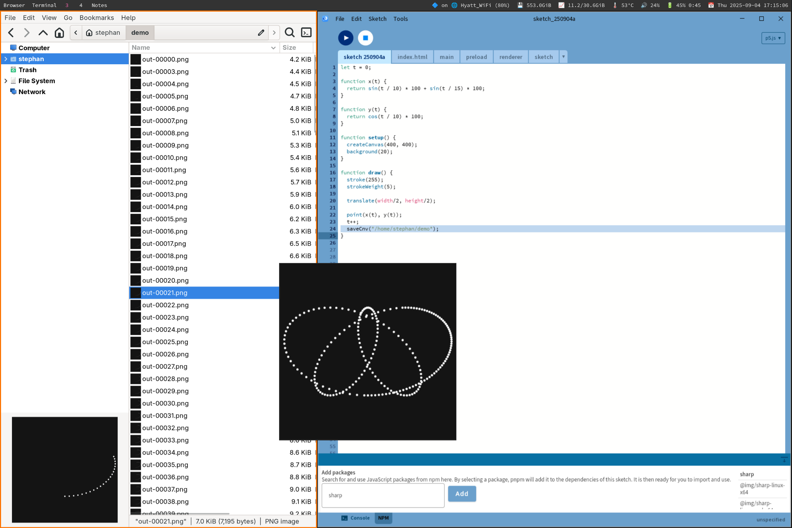

# Monthly Report – August: Desktop Support for p5.js via a New Processing Mode

## Overview

The goal of this month was to turn the proof of concept into a proper mode with the capability to install arbitrary `npm` packages. This included putting all Electron scaffolding—HTML and JavaScript code—as files into a sub-folder of the project rather than hard-coding it in Kotlin. Gradle allowed me to copy them over into a resources folder of Processing and make them accessible during runtime. I also pieced together a simple user interface to search [npm’s registry](https://registry.npmjs.org) for packages and install them at the touch of a button. This allows p5.js sketch authors to leverage not only Node’s [standard library](https://nodejs.org/docs/latest/api/) but also the vast landscape of third-party Node packages. Saving each frame of an animated sketch anywhere in the file system via Node’s `fs` and `path` modules hopefully demonstrates the potential of this project.

## Key Decisions and Progress

We do not want to lock sketch authors in the Processing Development Environment, but allow them to work on their p5.js code in whatever environment they feel comfortable in. Hence we made it a requirement that every p5.js sketch created in Processing is just a collection of JavaScript and HTML files that can be built (`npm install`) and run (`npx electron .`) with common JavaScript tooling and in any editor.

For the Node package management, we decided to go with `pnpm` rather than vanilla `npm` or `yarn`. The main motivation behind `pnpm` is one of the challenges of this project: saving space and time by reusing Node packages across potentially many sketches, not least the required `electron` and `p5`. `pnpm` also doubles as a Node version manager and has proven to be a promising tool on the JavaScript side of this project. More information can be found in [the project’s wiki](https://github.com/stephanmax/processing4/wiki/Chosen-Technologies#node-package-management) where I document the reasoning behind chosen technologies.

## Challenges and Solutions

The big challenge of this milestone was getting into user interface programming with Kotlin and [Compose](https://www.jetbrains.com/help/kotlin-multiplatform-dev/compose-multiplatform.html). I am used to building UI for the web with constant access to a browser’s developer tools and years of experience in established patterns that tie together UI, state, and behavior. Thankfully, online resources and communities on Compose, its interoperability with Java’s Swing framework, and managing state are abundant and high-quality. I am enjoying coding in Kotlin more and more.

## Next Steps

Month and milestone 3 are all about improving the mode’s UI and user experience and getting a working version in front of as many people as possible. That includes more editor capabilities (error reporting, autocomplete, syntax highlighting) and a better communication to the user what processes are running behind the scenes and when they are finished; think Node package installation, what packages are installed, hints that the HTML file that is loaded in Electron needs updating when sketch files are renamed or added… or doing that automatically even.

We also decided to add a compelling example sketch in TypeScript to demonstrate how JavaScript build tooling and Processing can cooperate further.

## Relevant Resources

- [Project repository](https://github.com/stephanmax/processing4/tree/main) with the [working branch](https://github.com/stephanmax/processing4/tree/pr05-poc)
- [Project wiki](https://github.com/stephanmax/processing4/wiki)

### Recommended Learning

- [Programming Kotlin](https://pragprog.com/titles/vskotlin/programming-kotlin/) by Venkat Subramaniam (Especially chapters on Lambdas and Coroutines)
- [Philipp Lackner’s Youtube channel](https://www.youtube.com/@PhilippLackner/videos) has been a great source for introductory videos around Kotlin and Compose for me. I appreciate a short bird’s eye view on things before diving into the docs and manuals.
