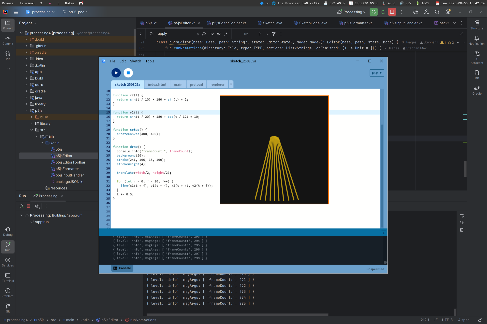

# Monthly Report – July: Desktop Support for p5.js via a New Processing Mode

## Overview

This month was all about learning the necessary skills for this project: brushing up on Java; learning Kotlin with a focus on its differences compared to Java, Java interoperability, and object-oriented programming; and growing familiar with Gradle. There is still a lot to learn, but I have been feeling confident enough to make my dent in the Processing code base. For that we decided to integrate [Stef’s proof-of-concept p5.js mode](https://github.com/Stefterv/processing-p5js-mode) into Processing as a second core mode next to the default Java one. Apart from this migration, milestone 1 also included communication between a running sketch inside Electron and the Processing Develoment Environment (PDE). I achieved this one-way from Electron to the PDE. p5.js sketches can now be run out of the PDE and Electron’s console output is mirrored to the PDE console.

## Key Decisions and Progress

We decided to stick with the technology—Electron as the internal Browser engine to render p5.js sketches—established by Stef’s PoC. No other decisions have been necessary so far. I am using [Electron’s Inter-Process Communication](https://www.electronjs.org/docs/latest/tutorial/ipc) capabilities to pipe console output of the sketch rendering process back into the PDE console.

## Challenges and Solutions

There were no “hard” challenges regarding used technology, build setup, or code base literacy. My challenges and learnings this month rather lean towards the personal side and character traits. I know that I am prone to going depth-first, rather than breadth-first, which means I tend to get lost in details of very specific areas of the code instead of making sure that a functional vertical slice of the project is present and moved forward. Even though I tried my best to have a demonstrable version of the p5.js mode ready, I became easy prey to the inner workings of Gradle build scripts and core application classes like `Base`, `Editor`, and `Mode`.

The solution to this is my attentive mentor, Stef, who helped me steer back on track. I also decided to maintain a [project wiki](https://github.com/stephanmax/processing4/wiki) where I can get my learnings out on paper and remove the occupying attention residue.

Due to a sick leave of one week, I am a bit behind schedule. However, I invested some time into rearranging competing workload and am confident to make up for the lost time in the first half of August.

## Next Steps

I plan to improve the user experience of the p5.js mode and pave the way for npm package handling. This includes two-way communication between PDE and sketch (react to canvas size changes, hot reloading, debugger), integration of the Node runtime, move HTML and JavaScript resources needed by Electron into a dedicated space to allow the robust (re-)execution of multiple sketches.

## Relevant Resources

- [Project repository](https://github.com/stephanmax/processing4/tree/main) (Processing 4 fork)
  - [Working branch](https://github.com/stephanmax/processing4/tree/pr05-poc)
- [Project wiki](https://github.com/stephanmax/processing4/wiki) (everything I deem worthy dumped on the homepage for now to avoid premature content organization; will improve structure as I go)

### Recommended Learning

- [Programming Kotlin](https://pragprog.com/titles/vskotlin/programming-kotlin/) by Venkat Subramaniam
- [Build Java Software With Gradle Like a Pro (Full Gradle Course)](https://www.youtube.com/watch?v=SJKXJHKTRX8) by Tom Gregory (build script DSL of choice if Groovy, not Kotlin; some things are out of data; still: core content is valid and helps building lasting mental models)
- [Stef’s Gradle Runner PR for a new internal build system](https://github.com/Stefterv/processing4/pull/7)
