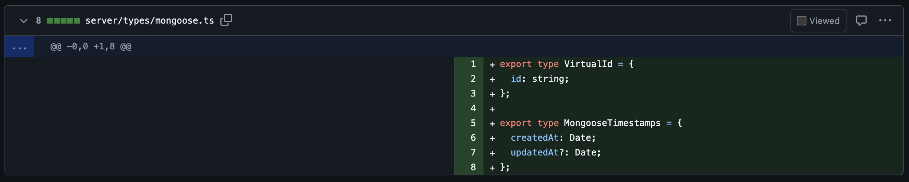

# Monthly Report - September: Incremental Typescript Migration for the p5.js Web Editor

## Overview

Over September, I pivoted from the previous work on migrating the `client` folder to concentrating on setting up migration for the `server` folder. This included:

- Setting up TS dependencies on the `server` folder
- Migrating the `server/routes` folder
- Migrating server files related to emailing capabilities
- Migrating the `User` model and `ApiKey` schema
- Starting to migrate the `User` controller

The decision to pivot from the `client` folder to the `server` folder came from [attempting to migrate an instance of redux reducers/actions](<(https://github.com/processing/p5.js-web-editor/pull/3633)>), where I chose the user preferences reducers/actions and I found that it would greatly improve developer experience by adding types to the server, so that it could act as a source-of-truth for API specs that could be found easily at a glance.

I also addressed feedback from last month's PR's for the `client` folder.

## Challenges, Progress & Key Decisions:

This month started with easy-wins and ended with some great challenges, as the first steps of `server` folder migration started with repeating some flows I had learned in the previous two months on the `client` folder migration; then ended with learning about the intricacies of `mongoose` Typescript syntax, which I am still continuing to learn about.

### Setting Up TS Dependencies on the `server` folder:

Following what I learned for the client migration and had already set up for the repo, setting up TS dependencies on the `server` folder went relatively smoothly. I made the following changes:

- Set up tsconfig for the `server` folder
- Add a `typecheck:server` command to `package.json`, and manually checked that `typecheck:server` flags type-errors on .ts and .tsx files, and that it checks the `server` folder independently of the `client` folder

I then tested my work by migrating `/server/utils/generateFileSystemSafeName`, chosen as it was a simple file to understand. Upon running the app locally, I found that there were additional configurations needed, as webpack and babel weren't able to automatically resolve files ending in `ts`. Resolving these required some research but were the steps below:

- Updating `nodemon` to hot-reload upon ts-file updates
- Updating `webpack` to resolve extensions with server folder modules
- Updating `root/index.js` configurations for `@babel/register` to resolve server files with `@babel/preset-typescript` where appropriate.

### Migrating the email system:

I initially intended to migrate the entire `server/views` folder, but I found that there were many files related to rendering email templates, so I thought it would be a good workflow to migrate the email system. This included:

- Adding a `server/types` folder, with the first file being `email` to store all email-related types
  - All proceeding types will be stored in a barrel structure and exported to a `server/types/index.ts`
- Migrating & extracting types from:
  - `server/views/mail.ts`
  - `server/views/consolidationMailLayout.ts`
  - `server/utils/renderMjml.ts`
  - `server/utils/mail.ts`
- Updating any `default` exports to `named` exports, as per the style of the `client` files.

### Initial migration attempt for the User model, routes, controller:

[I then attempted to migrate the entire `User` "system" (model, routes, controller)](https://github.com/clairep94/p5.js-web-editor/pull/13/files), but this proved extremely difficult, as I didn't know much about Mongoose Typescript best practices. I started migrating the controller file by adding types directly to the `req` and `res` parameters, but I ran into unexpected type errors in the routes file. It turned out that Express expects controllers to use the `RequestHandler` type, with the type parameters defined in the angle brackets to specify things like route params, response body, and request body.

I also did not add unit tests during this initial attempt, so it felt risky as the codebase did not have existing tests for the User model, and only had tests for the API Key portion of the User controller.

I felt it was best to re-start and take things much slower, focusing on the User routes, and User model for the remainder of the month, adding tests as I go to ensure that nothing regresses during migration.

### Migrating the Routes folder:

After this pivot, I did a bulk migration of the `server/routes` folder, as I knew these files would not require many changes or need to extract types. One improvement from this work was that upon updating files to `ts`, I was hinted by the IDE to update some outdated syntax for creating a `Router` instance.

While a super small change, a lot of files in the `server` folder have not been actively worked on for several years, and without typescript, we would not have known that this syntax was outdated which may have risked unexpected bugs.

### Migrating the User Model:

I then worked on migrating `server/models/user`. As mentioned this file did not have corresponding unit tests for any of the model methods, so it was risky to migrate without first adding tests. I felt the code organisation could also be improved as the `server/models/user` file also included the `apiKey` schema, which could be moved to its own file for better separation of concerns.

To this end, I:

- Added unit tests for `apiKey` schema methods
- Added unit tests for `user` model methods, and installed `mongodb-memory-server` which creates an in-memory test mongodb to run tests against locally and on CI
- Migrated `apiKey` to its on file within `/server/models`
- Extracted definitions for the `Document` and `Model` types for both `apiKey` and `user`

I found the last step quite challenging, as I had never worked on mongoose with typescript before, and defining types can be quite verbose.

The below is a best-effort at extracting types, which I believe does improve legibility for the codebase and give contributors a way to see definitions at a glance.

For example, we now have a definition for `UserPreferences`, which can then be used as the source of truth for the `client` redux system for user preferences.

### Migrating the User Controller:

For the remainder of the month, I worked towards migrating the user controller, which I will discuss more in detail in October's report upon completion of that file.

## PR's:

### Updated from previous month to address feedback & now merged:

- [pr05 Typescript #8: migrate client/components/Menubar/MenubarSubmenu](https://github.com/processing/p5.js-web-editor/pull/3623)

### Current Month PR's - Merged:

- [pr05 Typescript Migration #10: Setup Server TS Dependencies & migrate instance of server file](https://github.com/processing/p5.js-web-editor/pull/3636)
- [pr05 Typescript Migration #11: Migrate server/routes folder](https://github.com/processing/p5.js-web-editor/pull/3643)
- [pr05 Typescript Migration 12: Migrate server files related to emailing/nodemailer](https://github.com/processing/p5.js-web-editor/pull/3658)
- [pr05 Typescript Migration #13: Migrate the User Model (& API Key schema)](https://github.com/processing/p5.js-web-editor/pull/3672/files)
